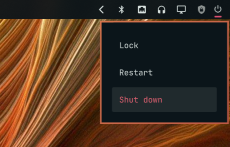

# Simple Power Menu

A compact power menu for the Omarchy bar. It adds a fine-line power icon and
opens a small native popover beside the icon rather than a menu in the middle
of the screen.



## Features

- Compact 12px power glyph with a fine stroke
- Native popover anchored to the bar icon
- Lock, restart, and shut-down actions
- Mouse and keyboard navigation
- Follows the active Omarchy theme and bar position

## Requirements

- Omarchy Quattro with shell-plugin support

There are no external services, network calls, or additional runtime
dependencies. The plugin invokes only Omarchy's built-in `omarchy system`
commands.

## Installation

```bash
omarchy plugin add https://github.com/jordanneenan/simple-power-menu.git --enable
```

The manifest places the widget in the right section of the bar by default.
You can move it later with:

```bash
omarchy bar move io.github.jordanneenan.simple-power-menu --section right
```

## Usage

Click the power icon to open the menu. Choose **Lock**, **Restart**, or
**Shut down**. You can also use the up and down arrow keys, press Enter to
activate an item, or press Escape to close the menu.

Restart and shut down take effect immediately after selection.

## Security and behavior

Like all Omarchy shell plugins, Simple Power Menu runs unsandboxed with the
current user's permissions. It executes an Omarchy system command only after
the user selects an action. It does not use the network, request elevated
privileges, write configuration or data files, or run background services.

## Removal

```bash
omarchy plugin remove io.github.jordanneenan.simple-power-menu
```

## Development

Validate a local checkout with:

```bash
omarchy plugin validate .
/usr/lib/qt6/bin/qmllint -I "$OMARCHY_PATH/shell" BarWidget.qml Panel.qml
```

After changing QML, rescan local plugins with:

```bash
omarchy-shell shell rescanPlugins
```

## License

[MIT](LICENSE)
